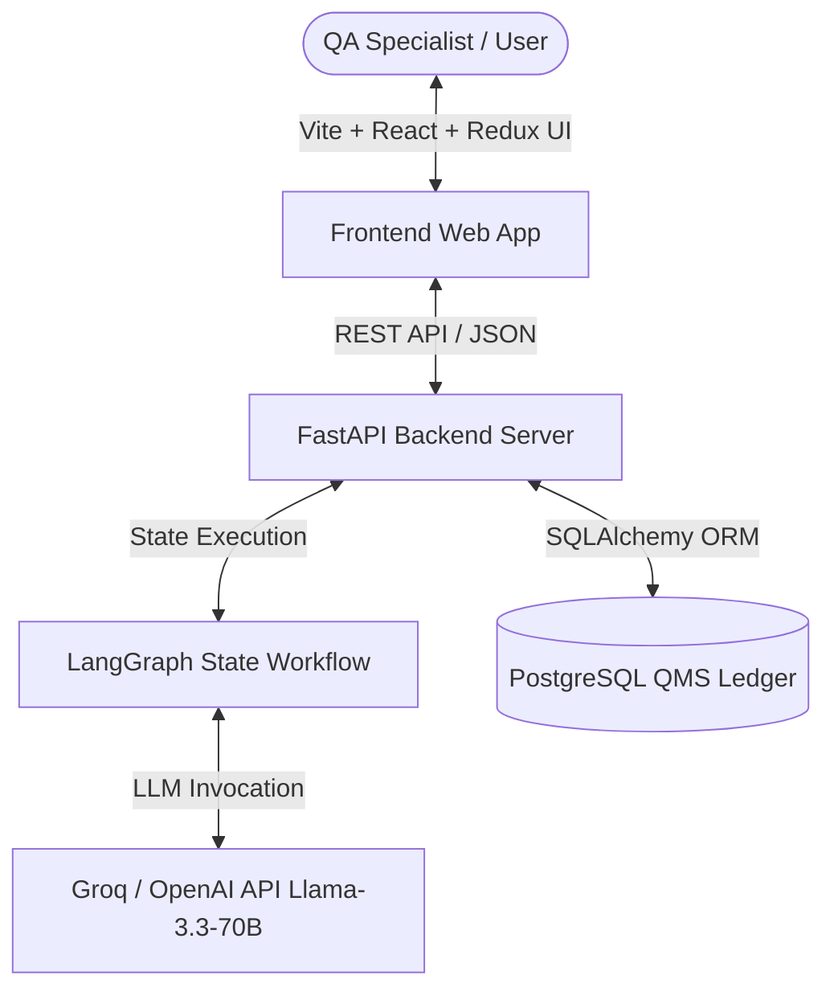
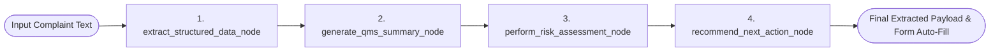

# 10–15 Minute Demo Script & Technical Architecture Guide
## AI-Powered Pharmaceutical Customer Complaint Management System

---

## ⏱️ Demo Outline & Time Breakdown

| Timestamp | Topic / Section | Focus Area |
| :--- | :--- | :--- |
| **0:00 – 2:30** | **1. System Overview & Architecture** | Business Problem, End-to-End Stack (FastAPI, React, PostgreSQL, LangGraph). |
| **2:30 – 6:00** | **2. LangGraph Execution Engine** | Directed Acyclic Graph (DAG), `ComplaintState`, 4-node pipeline flow. |
| **6:00 – 9:30** | **3. Frontend Workflow & UX** | Split-Screen UI, Redux Toolkit state, Light Mode theme, Typing Indicator. |
| **9:30 – 13:00** | **4. Live Functional AI Demo** | Complaint intake, PDF parsing, state-preserving follow-up field corrections, plain-text QMS summary. |
| **13:00 – 15:00** | **5. Key Design & Architecture Decisions** | State preservation logic, markdown sanitization, rule-engine fallbacks, PostgreSQL ledger persistence. |

---

## 🎬 Section 1: System Overview & High-Level Architecture (0:00 – 2:30)

### 📌 Spoken Script / Presenter Notes:
> *"Welcome everyone! Today I'm excited to present our AI-Powered Pharmaceutical Customer Complaint Management System. In pharmaceutical quality management (QMS), incoming complaints arrive as unstructured text—such as emails, call logs, or PDF inspection reports. Manually reviewing, categorizing, and transcribing these into formal quality ledgers is slow, error-prone, and delays compliance investigations.*
> 
> *Our system solves this by introducing a dual-screen AI Copilot interface that automatically parses complaints, extracts structured metadata, runs root-cause risk assessments, generates formal plain-text QMS summaries, and seamlessly commits validated records to a PostgreSQL quality ledger."*

### 🛠️ Architecture Overview Diagram

---

## 🧠 Section 2: LangGraph Implementation & Code Flow (2:30 – 6:00)

### 📌 Spoken Script / Presenter Notes:
> *"At the core of our AI processing engine is **LangGraph**—a stateful orchestration framework designed for multi-step AI workflows. Rather than running a single monolithic LLM prompt, we model the complaint intake lifecycle as a state machine graph (`ComplaintState`).*
> 
> *Each incoming request passes through a sequence of 4 specialized nodes, where each node updates specific state keys before handing off context to the next step."*

### 🔄 LangGraph State Machine (DAG Flow)

### 🧩 Node Breakdown & Responsibility

1. **`extract_structured_data_node`**:
   - **Role**: Parses 8 structured parameters (*Customer, Product Name, Batch Number, Mfg Date, Expiry Date, Facility, Impacted Material, Complaint Category*).
   - **Smart Feature**: Includes state-preserving logic for follow-up prompts. If `existing_form_data` is provided, it extracts only the corrected fields while preserving all unmentioned parameters.
   - **Rule-Engine Fallback**: Uses regex patterns to guarantee valid data extraction even if the external LLM call experiences network latency or failures.

2. **`generate_qms_summary_node`**:
   - **Role**: Converts informal customer complaints into formal QMS descriptions.
   - **Sanitization**: Strips markdown bold syntax (`**`) and asterisks to ensure compliance with strict plain-text pharmaceutical ledgers.

3. **`perform_risk_assessment_node`**:
   - **Role**: Evaluates health hazard severity (**Minor**, **Major**, or **Critical**) based on reported defects (e.g., discoloration, seal failures, toxicity) and generates an engineering risk description.

4. **`recommend_next_action_node`**:
   - **Role**: Recommends standard operating procedure (SOP) next steps (e.g., batch quarantine, senior QA routing, routine review) and formats the copilot chat response message.

---

## 💻 Section 3: Frontend Workflow & UX Design (6:00 – 9:30)

### 📌 Spoken Script / Presenter Notes:
> *"Let's look at the frontend architecture. Built with **Vite, React, and Redux Toolkit**, the user interface uses a modern split-screen layout designed for maximum efficiency:*
> 
> - **Left Panel (Interactive Form)**: Displays auto-populated complaint fields. QA specialists can review or manually override any extracted value.
> - **Right Panel (AI Copilot Chat)**: Provides a chat interface where users can paste raw complaint text, upload PDF documents, or issue follow-up correction prompts.
> 
> *Notice our recent UX refinements: a clean Light Mode theme with tailored color design tokens, and a custom animated typing loader (`typing-indicator`) that gives real-time visual feedback while the AI graph executes."*

---

## 🚀 Section 4: Live Demo Script & AI Capabilities (9:30 – 13:00)

### 📌 Spoken Script / Live Demonstration Sequence:

#### **Step 1: Initial Complaint Intake & Auto-Fill**
* **Action**: Paste the following text into the Copilot chat:
  > `"Customer Metro Health Pharmacy reported an issue with Amoxicillin 500mg Capsules, Batch B-77401. Mfg date Jan 2026, Expiry Dec 2027. Packaging defect with severe capsule discoloration and broken foil seal."`
* **Demonstrate**: 
  - Show the animated **"AI Copilot is thinking..."** typing dots.
  - Highlight the instant auto-filling of all 8 form fields on the left panel.
  - Point out the plain-text **QMS Summary** (no asterisks) and **Major** risk rating.

#### **Step 2: Follow-Up Field Correction (State Preservation)**
* **Action**: Send the follow-up prompt:
  > `"Correction: The batch number should be AMX-9982-X and the expiry date is November 2028."`
* **Demonstrate**:
  - Point out that **only** `batch_number` updated to `AMX-9982-X` and `expiry_date` updated to `November 2028`.
  - Show that `product_name`, `customer_name`, `manufacturing_date`, and `facility` remained **completely preserved**.
  - Show that date cleaner automatically stripped the filler word `"is"` from `"is November 2028"`.

#### **Step 3: PostgreSQL Database Ledger Commitment**
* **Action**: Click **"Log to QMS Ledger"**.
* **Demonstrate**:
  - Show the successful commit toast notification.
  - Open the **QMS Audit Ledger Modal** to show the saved record with its auto-generated database ID and timestamp.

---

## ⚙️ Section 5: Key Architectural & Technical Decisions (13:00 – 15:00)

### 📌 Spoken Script / Presenter Notes:
> *"To conclude, I'd like to highlight 4 critical design decisions that make this system enterprise-ready:*
> 
> 1. **State-Preserving Field Updates**: By passing current form data back to the backend, our AI performs surgical field updates during follow-up prompts without resetting the rest of the form.
> 2. **Plain-Text Output Enforcement**: Prompt instructions and post-processing regex sanitizers guarantee clean text without markdown syntax (`**`), making LLM responses directly compatible with legacy QMS database columns.
> 3. **Hybrid Extraction Strategy**: Combining LLMs with regex rule engines provides fallback reliability if the API is offline or slow.
> 4. **Decoupled Architecture**: FastAPI backend + LangGraph workflow + React/Redux frontend ensures clean separation of concerns and independent scalability."*

---

## 🎯 Quick Cheat-Sheet for Q&A

- **Q: How does follow-up correction avoid wiping existing form data?**
  - *A: The frontend thunk passes `current_form_data` to `/complaints/process`. LangGraph's `extract_structured_data_node` compares extracted fields against existing values and executes a merge pass.*
- **Q: Why use LangGraph instead of standard LangChain chains?**
  - *A: LangGraph provides stateful cyclic workflow support, enabling explicit state passing (`ComplaintState`) between specialized processing nodes.*
- **Q: How are database records persisted?**
  - *A: SQLAlchemy ORM maps the validated JSON payload into PostgreSQL tables via the `/complaints/commit` endpoint.*
